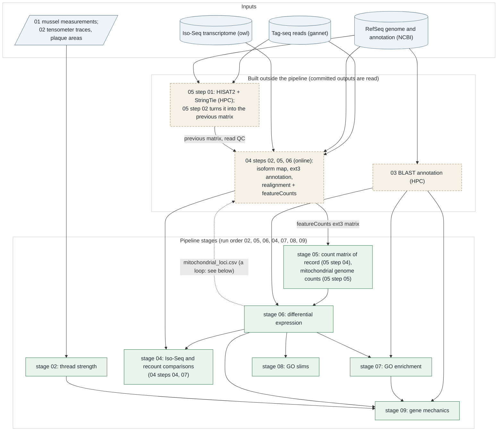
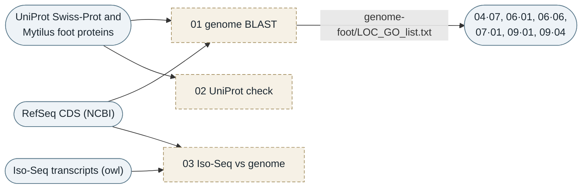
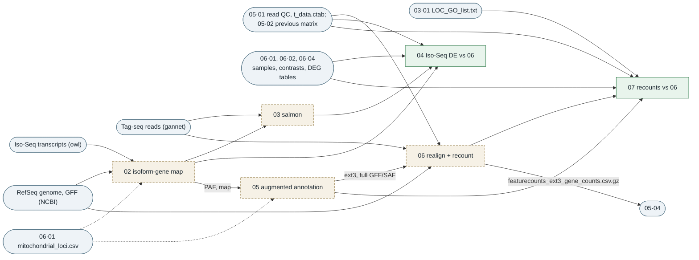
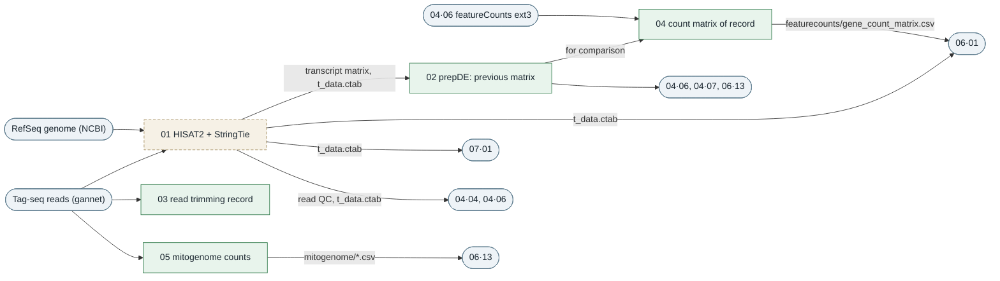
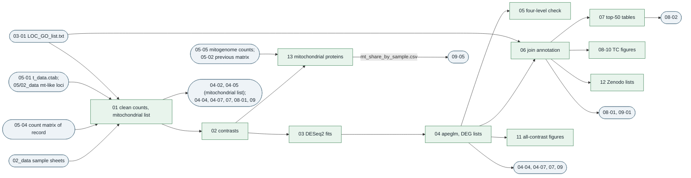
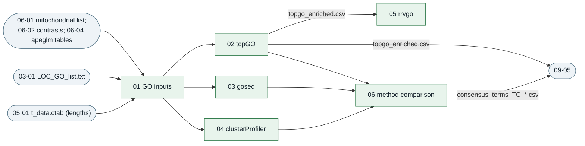

# PSMFC-mytilus-byssus-pilot

Byssal thread attachment of *Mytilus trossulus* under ocean acidification, warming and
hypoxia: tensometer pull tests before and after a 3-day exposure, foot and gill Tag-seq, and
the link between the two.

# How to run

Knit `00_run_pipeline.Rmd` at the repository root (inside `PSMFC-mytilus-byssus-pilot.Rproj`).
It runs, in order and each in a fresh R process, the batch runner of every folder that can run
from the committed data: thread strength (02), the count matrices (05), differential expression
(06), the Iso-Seq sensitivity analysis (04, from its committed gene counts), GO enrichment (07),
GO slims (08) and the gene-mechanics associations (09). About 35 minutes. Reports and logs go
to each folder's `03_analyses/knit_html/` and, one per stage, to
`knit_html/` at the root (all git-ignored). See `AGENTS.md` for the conventions and `tasks.md`
for what is done and open.

# Analysis folders

Each analysis folder (`02_` to `09_`) is self-contained with its own `.Rproj`, `01_code/`,
`02_data/`, `03_analyses/` and a README. Open the folder's own `.Rproj` (not the
repository-root one) before knitting a single script, so `here::here()` resolves to that
folder. In every `01_code/`, `00_run_*.Rmd` is the folder's batch runner and `01_` onwards are
the steps in run order; `_*.R` files are helpers they source. Each script writes only to its
own folder's `03_analyses/`; later folders read earlier ones.

| folder | what it does | run |
|---|---|---|
| `00_experiment_plan/` | experimental design slides and photos | reference only |
| `00_treatment_conditions/` | tank DO, pH, temperature and salinity record and summary table | reference only |
| `01_mussel-measurements/` | mussel size, condition and thread-production workbooks | input: `mussel-size-measurements.xlsx` feeds `02_thread-strength` script 01 |
| `02_thread-strength/` | tensometer trace extraction, thread summary, per-animal ANCOVA on adhesion, mean and maximum peak force and plaque area | `01_code/00_run_thread_strength.Rmd` |
| `03_blast/` | BLAST annotation of the genome CDS and the Iso-Seq transcriptome; the `genome-foot/` GO mapping used downstream | HPC method record; outputs committed |
| `04_iso-seq-transcriptome/` | sensitivity branch: the TC contrasts repeated with the reads quantified against the Iso-Seq transcriptome (isoforms mapped to genome genes, salmon, tximport) and compared with `06`; and option B, adopted 2026-10-02: the reads realigned to the genome and counted with featureCounts on the RefSeq annotation with Iso-Seq-extended 3' ends, which is **the count matrix of record** | runner `01_code/00_run_isoseq.Rmd` (steps 04 and 07 by default; steps 02-07 with `online: true`) |
| `05_sequence-alignment/` | read QC and trimming record, the count matrix of record (from `04`), the mitochondrial genes counted on the mitochondrial genome alone, and the previous HISAT2 + StringTie count matrices (HPC record) | `01_code/00_run_sequence_alignment.Rmd` |
| `06_differential-expression/` | DESeq2 for 7 contrasts (each stressor vs the day-3 treatment control, and foot vs gill), DEG annotation, figures; the mitochondrial proteins on their own (with the mitochondrial haplotype groups) | `01_code/00_run_differential_expression.Rmd` |
| `07_enrichment/` | GO enrichment: topGO (of record), goseq, clusterProfiler, rrvgo, method comparison | `01_code/00_run_enrichment.Rmd` |
| `08_gene-annotation/` | GO slims of the TC DEGs; NCBI summaries and orthologs for the top DEGs (network) | `01_code/00_run_gene_annotation.Rmd` |
| `09_gene-mechanics-correlation/` | per-animal ANCOVA of day-3 thread mechanics on genes, DEG sets, enriched GO terms and mitochondrial expression, foot and gill | `01_code/00_run_gene_mechanics_by_tissue.Rmd` |

Run order: `02_thread-strength` and `05` -> `06` (independent of each other), then
`04_iso-seq-transcriptome` (it repeats `06`'s contrasts on the Iso-Seq reference),
`07_enrichment` and `08_gene-annotation` (they read `06`), and
`09_gene-mechanics-correlation` last (it reads `02`, `03`, `06` and `07`). `00_run_pipeline.Rmd`
follows this order. The folder numbers are not the run order: `04` holds steps on both sides of
`05` and `06`. "How the steps connect", below, maps what every step reads and writes.

Other folders:

- `tools/`: shared helpers (README inside): `run_steps.R` (the runners), `plot_style.R` (the
  one set of figure colours: control grey, OA green, OW orange, DO purple; red up, blue
  down), `gene_ids.R` (`gene_key()`, the one way gene names are joined to annotation),
  `mt_encoded.R` (the mitochondrial loci of the count matrix) and `pipeline_checks.R` (run
  checks and `RUN_provenance*.txt`).
- `instrument-reference/`: tensometer manual, LabVIEW logger and wiring notes.
- `template-oyster-pipeline/`: Tag-seq code from the triploid oyster heatwave project, kept as
  a template; not part of this analysis.

## Samples

Tissue was foot or gill. Every animal has a library of the phenol gland to the tip of the foot
(IDs ending `F`) and of the gill (`G`); the twelve day-0 animals also have a library of the
rest of the foot (`FX`). The day-0 animals are not used as a control (their feet were
dissected differently); every contrast is against the day-3 treatment control. The sample sheets name these
inconsistently; `06_differential-expression/03_analyses/count_matrix/library_crosswalk.csv`
maps every library to its RNA isolation record.

## Cross-folder paths

Scripts refer to other analysis folders by name, so renaming a numbered folder breaks them.
The names are set in each folder's `01_code/_paths.R` (06, 07, 08), the `paths` chunk of each
`09_gene-mechanics-correlation/01_code/0*.Rmd` script and its runner,
`02_thread-strength/01_code/01_build_mussel_key.Rmd`, the stage table of `00_run_pipeline.Rmd`
and `psmfc_repo_root()` in `tools/pipeline_checks.R`.

## Large files

Files too large for GitHub, such as the raw Tag-seq reads
(`20220405-tagseq/`), are stored on gannet:
https://gannet.fish.washington.edu/panopea/PSMFC-mytilus-byssus-pilot/

# How the steps connect

What every step reads and writes, traced from the code (2026-10-03). The overview shows the
folders; below it, each folder has a diagram of its own steps and a table. Notation: `06·04`
means folder `06_`, step `04`. Unless a path says otherwise, a step writes inside its own
folder's `03_analyses/`, and the tables give paths relative to that folder. In the diagrams,
green steps run in `00_run_pipeline.Rmd`, dashed beige steps do not (they need an HPC or the
network, and their committed outputs are what later steps read), and blue rounded boxes are
inputs from outside the folder. The folder diagrams leave out an edge when another path
already implies it; the tables list every input.

## What the map shows about the order

- **The stage order is a valid order for what the pipeline runs.** Stage 04 runs only
  `04·04` and `04·07`, and both read `06`'s contrasts, sample table, mitochondrial list and
  DEG tables, so they come after stage 06. Stage 07 reads stage 06 and committed `03` and `05` files; stage 08
  reads only stage 06; neither reads the other. Stage 09 reads `02`, `06` and `07`.
- **The folder numbers are not a run order.** `04_iso-seq-transcriptome` holds work on both
  sides of `05` and `06`: `04·02`, `04·05` and `04·06` build the count matrix of record that
  `05·04` passes to `06`, while `04·03`, `04·04` and `04·07` are the Iso-Seq sensitivity
  analysis and the comparisons with `06`. `05` and `04` also read each other: `04·06` reads
  `05·01`'s read QC and transcript table and `05·02`'s previous matrix, and `05·04` reads
  `04·06`'s featureCounts matrix.
- **A loop through the mitochondrial list.** `06·01` builds `mitochondrial_loci.csv` from the
  rows of the count matrix of record. `04·02` reads it (an isoform assigned to a listed locus
  becomes `mitochondrial`, so `04·05` never extends a mitochondrial gene's 3' end) and `04·05`
  reads it (novel loci that overlap a listed locus are left out of the `full` annotation).
  The loop is at a fixed point: the list grew from 310 to 331 loci after those steps ran, and
  none of the 21 added loci (mitogenome tRNAs and rRNAs) has an isoform assigned to it, so
  rerunning would give the same annotation. A change to how `06·01` lists mitochondrial loci
  would mean rerunning `04·02`, `04·05`, `04·06`, then `05·04` and `06` again.
- **Committed inputs that no current step writes:** `03_blast/03_analyses/genome-foot/LOC_GO_list.txt`
  (`03·01` wrote it on the HPC; the script no longer runs as written),
  `05_sequence-alignment/03_analyses/hisat/t_data.ctab` (an older HPC run's copy, one
  sample's table; read for gene names and transcript lengths, which come from the reference
  annotation), `05 .../prepDE/transcript_count_matrix.csv` (HPC `prepDE.py`) and
  `05 .../fastqc/*/multiqc_data/` (run in the earlier `byssus-exp-analysis` repository).
  One-off helpers in `05_sequence-alignment/01_code/` (`_derive_mitogenome.R`,
  `_derive_mt_like_loci.R`, `_derive_strg_gene_ids.R`) wrote that folder's reference inputs in
  `02_data/`.

## 02_thread-strength

| step | in pipeline | reads | writes (`03_analyses/`) |
|---|---|---|---|
| 01 `01_build_mussel_key.Rmd` | yes | `01_mussel-measurements/mussel-size-measurements.xlsx`; the folder names in `02_data/tensometer_output/` | `01_build-mussel-key/mussel-treatment-key.csv` |
| 02 `02_extract_tensometer_data.Rmd` | yes | `02_data/tensometer_output/*/*.txt`; `02·01` key | `02_extract-tensometer-data/thread-summary-raw-output.xlsx`, `QC_plots/` |
| 03 `03_assemble_thread_summary.Rmd` | yes | `02·02` workbook; `02_data/pad_area_measurements.xlsx` (hand-entered plaque areas) | `03_assemble-thread-summary/thread-summary.xlsx` |
| 04 `04_analyze_thread_strength.Rmd` | yes | `02·03` summary; `_ancova.R`, `tools/plot_style.R`, `tools/pipeline_checks.R` | `04_analyze-thread-strength/`: `STATS_ancova_*.csv`, `DATA_ancova_animals.csv`, `DESC_*.csv`, `BP_*`, `LineBox_*` and `DIAG_*` figures, `RUN_provenance.txt` |
| 05 `05_decompose_adhesion.Rmd` | yes | `02·03` summary; `02·04` `STATS_ancova_vs_control.csv`; the same helpers | `05_decompose-adhesion/`: `STATS_ancova_*.csv`, `DATA_ancova_animals.csv`, `mussel_response_classification.csv`, `STATS_failure_mode.csv`, `FIG_*` figures, `RUN_provenance.txt` |

## 03_blast (HPC record, not run here)

| step | in pipeline | reads | writes |
|---|---|---|---|
| 01 `01_genome_blast.Rmd` | no (HPC) | RefSeq CDS (NCBI); UniProt Swiss-Prot 2024_01 and the UniProt Mytilus foot proteins (record copy in `02_data/`) | on the HPC: the blastx table, `LOC_GO_list.txt`, `g.spid.txt`; committed copies in `03_analyses/genome-foot/` |
| 02 `02_genome_blast_uniprot_check.Rmd` | no (HPC) | an HPC blastx table and UniProt annotation | HPC intermediates only |
| 03 `03_isoseq_vs_genome_blast.Rmd` | no (HPC) | Iso-Seq transcripts (owl), RefSeq CDS, foot proteins | HPC working files only |
| `_uniprot_retrieval.py` | no (by hand) | an accession list; rest.uniprot.org | `uniprot-retrieval.tsv`, committed in `03_analyses/transcriptome-uniprot/` |

## 04_iso-seq-transcriptome

| step | in pipeline | reads | writes (`03_analyses/`) |
|---|---|---|---|
| 01 `01_isoseq_transcriptome_check.Rmd` | no (knit by hand) | the Iso-Seq FASTA (owl) | a length QC in `01_code/01_isoseq_transcriptome_check.md` |
| 02 `02_isoform_gene_map.Rmd` | no (`online: true`) | Iso-Seq FASTA (owl); RefSeq genome and GFF (NCBI, MD5-checked); `06·01` `mitochondrial_loci.csv` and the first column of `gene_count_matrix_clean.csv` (a summary count only); the retired CDS map in `_superseded/` (a cross-check) | `02_isoform-gene-map/`: `isoform_gene_map.csv.gz`, `isoform_gene_map_summary.csv`, `cds_map_agreement.csv`, `RUN_provenance.txt` (PAF alignments git-ignored) |
| 03 `03_salmon_quant.Rmd` | no (`online: true`) | the 131 trimmed libraries (gannet); the Iso-Seq FASTA; `04·02` map | `03_salmon/`: `gene_counts.csv.gz`, `salmon_mapping_summary.csv`, `read_classes_by_library.csv`, `RUN_provenance.txt` |
| 04 `04_isoseq_de_comparison.Rmd` | yes | `04·03` counts and mapping summary; `04·02` map; `06·01` sample table, mitochondrial list and count matrix; `06·02` contrasts; `06·04` TC apeglm tables; `05·01` MultiQC | `04_isoseq-de/`: `*_TC_isoseq_apeglm.csv`, `reference_agreement.csv`, `isoseq_DEG_counts.csv`, `isoseq_only_DEGs.csv`, `counts_per_gene_both_references.csv`, `FIG_*`, `RUN_provenance.txt` |
| 05 `05_augmented_annotation.Rmd` | no (needs `04·02`'s git-ignored PAF and the GFF) | RefSeq GFF; `04·02` PAF and map; `06·01` `mitochondrial_loci.csv` | `05_augmented-annotation/`: `ext3_extensions.csv.gz`, `full_added_transcripts.bed.gz`, `novel_loci_fate.csv`, `annotation_summary.csv`, `RUN_provenance.txt` (the GFF/SAF annotations are git-ignored) |
| 06 `06_genome_recount.Rmd` | no (`online: true`) | `04·05` GFF/SAF; RefSeq genome and GTF (NCBI); the 131 trimmed libraries (gannet); `05·01` MultiQC and `t_data.ctab`, `05·02` matrix, `05/_prepde.R` (checks against the previous record) | `06_genome-recount/`: `{stringtie,featurecounts}_{refseq,ext3,full}_gene_counts.csv.gz`, `mapping_summary.csv`, `checks.csv`, `RUN_provenance.txt` |
| 07 `07_augmented_de_comparison.Rmd` | yes | `04·06` six recounts; `04·05` extensions; `05·02` previous matrix; `06·01` sample table and mitochondrial list; `06·02` contrasts; `06·04` TC apeglm tables; `03·01` `LOC_GO_list.txt` | `07_augmented-de/`: the apeglm tables of every recount, `deg_summary.csv`, `record_change.csv`, `annotation_effect.csv`, `control_vs_previous.csv`, `mitochondrial_share.csv`, `new_DEGs.csv`, `byssal_genes.csv`, `FIG_*`, `RUN_provenance.txt` |

## 05_sequence-alignment

| step | in pipeline | reads | writes (`03_analyses/`) |
|---|---|---|---|
| 01 `01_hisat_stringtie.Rmd` | no (HPC) | the 131 trimmed libraries; RefSeq genome and GTF (NCBI) | `hisat/`: MultiQC report and data, alignment logs (BAMs and per-sample tables are git-ignored) |
| 02 `02_prepDE.Rmd` | yes | `prepDE/transcript_count_matrix.csv` and `hisat/t_data.ctab` (HPC); `02_data/strg_gene_ids.csv`; `_prepde.R` | `prepDE/gene_count_matrix.csv` (the previous matrix) |
| 03 `03_read_trimming.Rmd` | yes (retention table); the recipe check needs `online: true` | `fastqc/*/multiqc_data/multiqc_fastqc.txt`; online: the first reads of one raw and one trimmed library (gannet) and the clipping script (GitHub) | `read_trimming/read_retention.csv`; online: `recipe_check.csv`, `RUN_provenance_recipe_check.txt` |
| 04 `04_count_matrix_of_record.Rmd` | yes | `04·06` `06_genome-recount/featurecounts_ext3_gene_counts.csv.gz`; `hisat/t_data.ctab` (gene names); `05·02` matrix (comparison) | `featurecounts/gene_count_matrix.csv`, `featurecounts/RUN_provenance.txt` |
| 05 `05_mitogenome_counts.Rmd` | yes (summary); alignment and counting need `online: true` | `02_data/mitogenome_genes.saf`; online: `02_data/mitogenome_NC_007687.1.fa` and the 131 trimmed libraries (gannet), `_mitogenome_library.sh` | online: `mitogenome/mitogenome_gene_counts.csv`, `mitogenome_gene_counts_permissive.csv`, `mapping_summary.csv`, `RUN_provenance.txt` (per-library files git-ignored) |

## 06_differential-expression

All 13 steps run in the pipeline.

| step | reads | writes (`03_analyses/`) |
|---|---|---|
| 01 `01_clean_count_matrix.Rmd` | `05·04` `featurecounts/gene_count_matrix.csv`; `02_data/` sample sheet and RNA summary; for the mitochondrial list, `03·01` `LOC_GO_list.txt`, `05·01` `hisat/t_data.ctab` and `05_sequence-alignment/02_data/annotation_mt_like_loci.csv` (`tools/mt_encoded.R`) | `count_matrix/`: `gene_count_matrix_clean.csv`, `treatmentinfo_clean.csv`, `library_crosswalk.csv`, `mitochondrial_loci.csv` |
| 02 `02_define_contrasts.Rmd` | `06·01` sample table | `DEG_lists/contrasts.csv`, `contrast_samples.csv` |
| 03 `03_deseq_contrasts.Rmd` | `06·01` counts, sample table, mitochondrial list; `06·02` contrasts | `dds/*.rds` (git-ignored), `DEG_lists/filter_summary.csv`, `figures/PCA_*.png` |
| 04 `04_shrinkage_filtration.Rmd` | `06·02` contrasts; `06·03` fits and filter summary | `DEG_lists/{Foot,Gill,Foot_vs_Gill}/<code>_{apeglm,siggene,filter_counts}.csv` and MA plots; `DEG_lists/DEG_counts.csv` |
| 05 `05_fourlevel_sensitivity.Rmd` | `06·01` counts, sample table, mitochondrial list; `06·04` DEG lists | `DEG_lists/sensitivity_fourlevel/` |
| 06 `06_join_annotation.Rmd` | `06·04` DEG lists; `03·01` `LOC_GO_list.txt`; `06·01` mitochondrial list | `DEG_lists/GOterms_genome/<code>_sigs_{merged,ID,unID}.csv`, `DEG_lists/DEG_join_summary.csv` |
| 07 `07_top_degs.Rmd` | `06·06` `*_sigs_ID.csv` | `top_DEGs/Top_50_genes/` |
| 08 `08_deg_venn.Rmd` | `06·06` `*_sigs_merged.csv` | `figures/TC_venn_*.png` |
| 09 `09_volcano_plots.Rmd` | `06·06` `*_sigs_merged.csv` | `figures/TC_volcano_{foot,gill}.png` |
| 10 `10_number_degs.Rmd` | `06·06` `*_sigs_merged.csv` | `figures/TC_DEG_numbers.png` |
| 11 `11_deg_figures_all_contrasts.Rmd` | `06·02` contrasts; `06·04` apeglm tables and DEG counts | `figures/DEG_counts_all_contrasts.png`, `volcano_TC.png`, `volcano_FG.png` |
| 12 `12_deg_list_cleanup.Rmd` | `06·06` `*_sigs_merged.csv` | `DEG_lists/GOterms_genome/clean_zenodo_files/` |
| 13 `13_mitochondrial_expression.Rmd` | `06·01` counts, sample table, mitochondrial list; `06·02` contrasts; `05·05` mitogenome counts (default and permissive); `05·02` previous matrix (comparison) | `mitochondrial/*.csv`, `figures/MT_mitochondrial_expression.png`, `MT_haplotypes.png` |

## 07_enrichment

All six steps run in the pipeline; every step reads `06·02` `contrasts.csv` through `_go_helpers.R`.

| step | reads | writes (`03_analyses/`) |
|---|---|---|
| 01 `01_go_inputs.Rmd` | `03·01` `LOC_GO_list.txt`; `05·01` `t_data.ctab`; `06·04` apeglm tables (all seven contrasts); `06·01` mitochondrial list | `01_go-inputs/gene_annotation.tsv`, `gene_sets_summary.csv`, `RUN_provenance.txt` |
| 02 `02_topgo.Rmd` | `07·01` annotation; `06·04` apeglm tables | `02_topgo/`: `topgo_enriched.csv`, `topgo_all_terms_TC_*.csv`, `topgo_run_summary.csv`, dotplots |
| 03 `03_goseq.Rmd` | as 02 | `03_goseq/`: the same set of tables, the PWF plot, dotplots |
| 04 `04_clusterprofiler.Rmd` | as 02 | `04_clusterprofiler/`: the same set of tables, dotplots |
| 05 `05_rrvgo.Rmd` | `07·02` `topgo_enriched.csv` | `05_rrvgo/`: `rrvgo_reduced_terms.csv`, `rrvgo_parents.csv`, figures |
| 06 `06_method_comparison.Rmd` | `07·02`, `07·03`, `07·04` `*_all_terms_TC_*.csv` | `06_method-comparison/`: `method_counts_*`, `method_agreement_*`, `method_pair_summary_*`, `consensus_terms_TC_*.csv`, figures |

## 08_gene-annotation

| step | in pipeline | reads | writes (`03_analyses/`) |
|---|---|---|---|
| 01 `01_go_slims.Rmd` | yes | `06·06` `*_sigs_ID.csv`; `06·01` mitochondrial list; `02_data/goslim_generic.obo` (GO release 2023-07-27) | `goslims/`: per-contrast slim tables, `goslim_summary_TC.csv`, `goslim_provenance.txt`, `goslim_TC_heatmap.png` |
| 02 `02_uniprot_summaries.Rmd` | no (`online_annotation: true`) | `06·07` top-50 tables; NCBI E-utilities (`ENTREZ_KEY`) | `Top_gene_summaries/<code>_topgene_summs.csv`, `RUN_provenance_summaries.txt` |
| 03 `03_ortholog_lists.Rmd` | no (`online_annotation: true`) | `08·02` summaries; OrthoDB 12 | `Top_gene_summaries/<code>_topgene_summs_ortho.csv`, `ortho_species.tab.gz`, `RUN_provenance_orthologs.txt` |

## 09_gene-mechanics-correlation

All five steps run in the pipeline, once for foot (`F`) and once for gill (`G`); outputs carry
the tissue suffix `<T>`.

| step | reads | writes (`03_analyses/`) |
|---|---|---|
| 01 `01_gene_mechanics_correlation.Rmd` | `02·03` `thread-summary.xlsx`; `02·05` `mussel_response_classification.csv` and both `DATA_ancova_animals.csv` (an agreement check); `06·01` counts, sample table, mitochondrial list; `06·04` TC DEG lists; `06·06` `*_sigs_ID.csv`; `03·01` `LOC_GO_list.txt`; `02_data/expected_animals.csv` | `gene_mechanics/`: `paired_sample_manifest_<T>`, `animal_reconciliation_<T>`, `vst_paired_<T>`, `annotation_map.csv`, `candidate_genes_<T>`, `metrics_config_<T>`, `detection_floor_flags_<T>`, `assoc_candidate_<T>`, `assoc_DEGunion_<T>` (csv), three figures, `RUN_provenance_<T>.txt` |
| 02 `02_gene_mechanics_expanded.Rmd` | `09·01` outputs only | `gene_mechanics/`: `module_members_<T>`, `module_associations_<T>`, `influence_top_hits_<T>`, `best_hits_<T>` (csv); adds its block to `RUN_provenance_<T>.txt` |
| 03 `03_rna_thread_manifest_and_expression_tables.Rmd` | `06·01` counts and sample table; `02·03` summary; `02·02` raw thread workbook; `06·04` TC DEG lists; `09·01` `annotation_map.csv` | `expr_tables/`: `rna_thread_manifest_<T>.csv`, `top25_updown_<T>_*.csv`, `sample_metadata_<T>.csv` |
| 04 `04_byssus_foot_gene_list_expression.Rmd` | `03·01` `LOC_GO_list.txt`; `06·04` TC DEG lists; `09·03` manifest; `02·03` summary; `06·01` counts | `byssus_genes/`: `byssus_gene_expression_<T>.csv`, `sample_metadata_<T>.csv`, `byssus_category_scores_<T>.csv` |
| 05 `05_go_term_mechanics.Rmd` | `09·01` manifest, VST and metrics; `06·04` TC DEG lists; `07·02` `topgo_enriched.csv`; `07·06` `consensus_terms_TC_*.csv`; `06·13` `mt_share_by_sample.csv` | `go_mechanics/`: `mechanics_sets_<T>.csv`, `mechanics_set_associations_<T>.csv`, `go_mechanics_<T>.png`, `RUN_provenance_<T>.txt` |

Every folder runner also writes its reports and logs to its own `03_analyses/knit_html/`
(git-ignored).

# Pertinent documents
## General
1. [Manuscript](https://docs.google.com/document/d/1fKfDU4gHPdMy9xejUA5pZ6YY2HVzsiGSGo7uFVgDln4/edit?usp=sharing)

## Manuals and Protocols
1. [Thread testing tutorial](https://monicaklopp.github.io/Thread-Testing-01-Notebook-Post/)
2. [Sam's RNA extraction notebook entries](https://robertslab.github.io/sams-notebook/2022/01/13/Project-Summary-Matt-George-PSMFC-Mytilus-Byssus-Project.html)
3. [RNA sample List](https://docs.google.com/spreadsheets/d/1PDVSGuCGeYQr6Rdl6u5M4L5vcQS1EgUQl7UjvLYDlBg/edit?usp=sharing)

## Datasets
1. [Tagseq dataset](https://docs.google.com/spreadsheets/d/1zZ6L05j-SyYJbzzQI_kBafFaReE4Ysp_9bORdbBu_r8/edit#gid=1302342348)
2. [RNA extraction results](https://docs.google.com/spreadsheets/d/1HizNOIfhSjppHDQrWLGiJhuDZKO8c-qm9JAz0Z5QIIQ/edit?usp=sharing)

## Github Issues
7. [RNA extraction github issue](https://github.com/RobertsLab/resources/issues/1352)
14. [Iso-seq analysis github issue](https://github.com/RobertsLab/resources/issues/1662)
