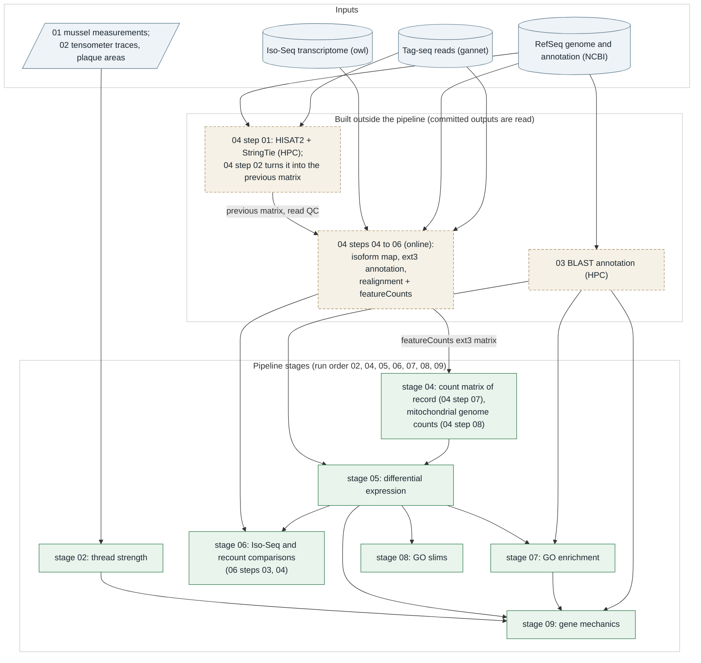
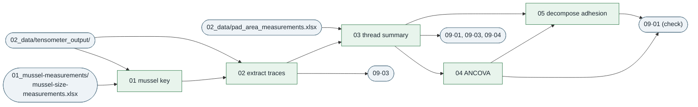
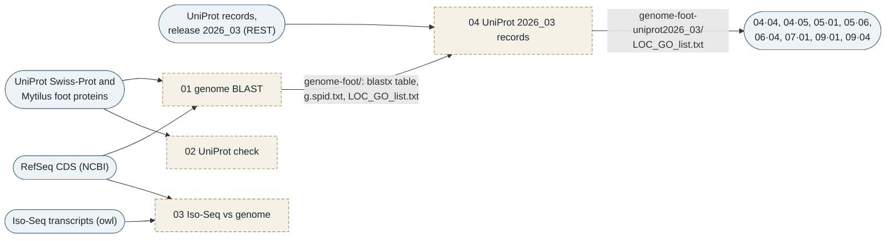
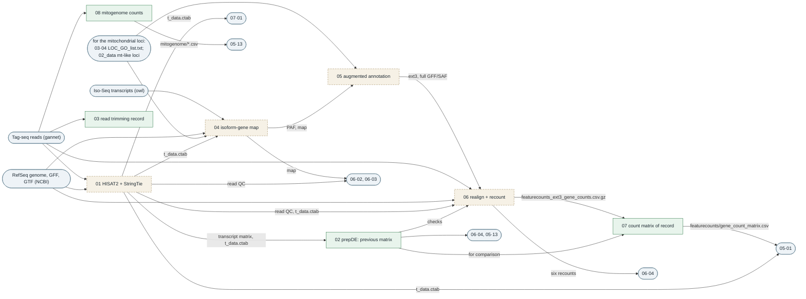
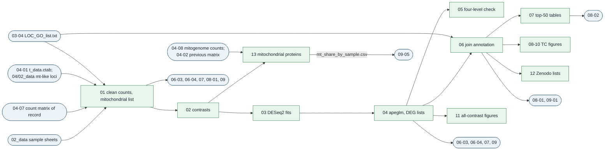
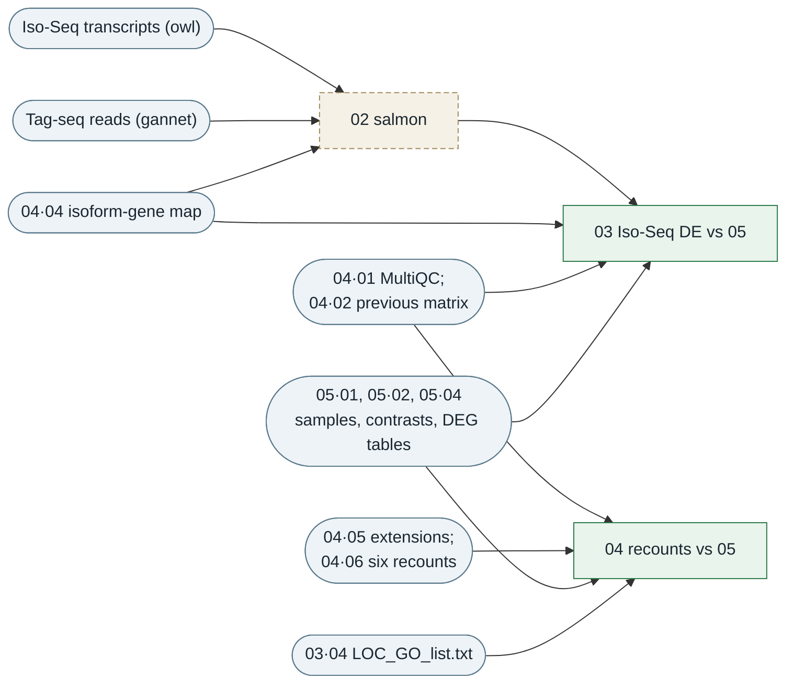
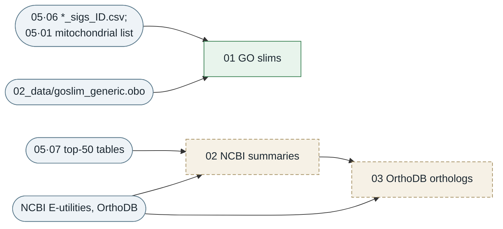
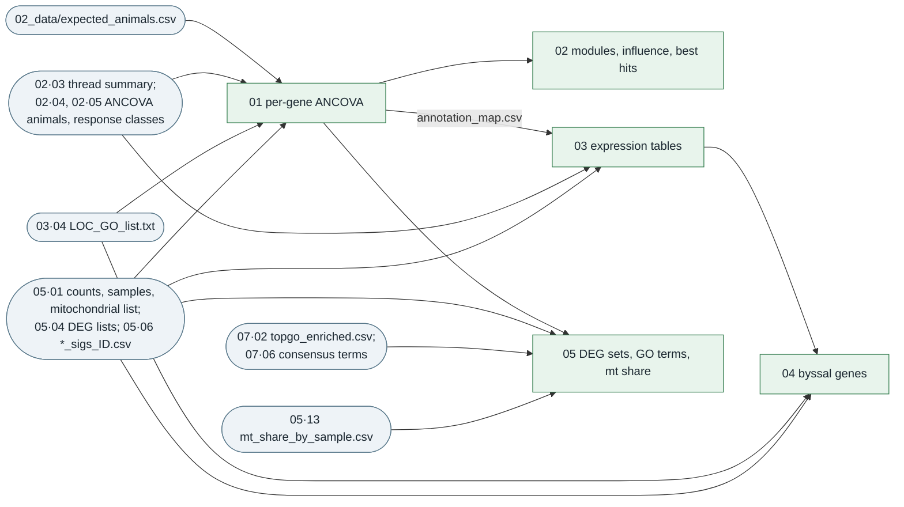

# PSMFC-mytilus-byssus-pilot

Byssal thread attachment of *Mytilus trossulus* under ocean acidification, warming and
hypoxia: tensometer pull tests before and after a 3-day exposure, foot and gill Tag-seq, and
the link between the two.

# How to run

Knit `00_run_pipeline.Rmd` at the repository root (inside `PSMFC-mytilus-byssus-pilot.Rproj`).
It runs, in order and each in a fresh R process, the batch runner of every folder that can run
from the committed data: thread strength (02), the count matrices (04), differential expression
(05), the Iso-Seq sensitivity analysis (06, from its committed gene counts), GO enrichment (07),
GO slims (08) and the gene-mechanics associations (09). About 35 minutes. Reports and logs go
to each folder's `03_analyses/knit_html/` and, one per stage, to
`knit_html/` at the root (all git-ignored). See `AGENTS.md` for the conventions and `tasks.md`
for what is done and open.

# Analysis folders

Each analysis folder (`02_` to `09_`) is self-contained with its own `.Rproj`, `01_code/`,
`02_data/`, `03_analyses/` and a README. Open the folder's own `.Rproj` (not the
repository-root one) before knitting a single script, so `here::here()` resolves to that
folder. In every `01_code/`, `00_run_*.Rmd` is the folder's batch runner and `01_` onwards are
the steps in run order; `_*.R` files are helpers they source. Each script writes only to its
own folder's `03_analyses/`; later folders read earlier ones.

| folder | what it does | run |
|---|---|---|
| `00_experiment_plan/` | experimental design slides and photos | reference only |
| `00_treatment_conditions/` | tank DO, pH, temperature and salinity record and summary table | reference only |
| `01_mussel-measurements/` | mussel size, condition and thread-production workbooks | input: `mussel-size-measurements.xlsx` feeds `02_thread-strength` script 01 |
| `02_thread-strength/` | tensometer trace extraction, thread summary, per-animal ANCOVA on adhesion, mean and maximum peak force and plaque area | `01_code/00_run_thread_strength.Rmd` |
| `03_blast/` | BLAST annotation of the genome CDS and the Iso-Seq transcriptome; the 2024 genome hits with UniProt release 2026_03 records (`genome-foot-uniprot2026_03/LOC_GO_list.txt`), the gene-to-GO table used downstream | HPC method record; outputs committed; step 04 rebuilds the table of record offline |
| `04_sequence-alignment/` | read QC and trimming record, the previous HISAT2 + StringTie count matrices (HPC record), the Iso-Seq isoforms placed on the genome, the RefSeq annotation with Iso-Seq-extended 3' ends, the reads realigned and counted with featureCounts on it (**the count matrix of record**), and the mitochondrial genes counted on the mitochondrial genome alone | `01_code/00_run_sequence_alignment.Rmd` (steps 02, 03, 07 and 08 by default; 02-08 with `online: true`) |
| `05_differential-expression/` | DESeq2 for 7 contrasts (each stressor vs the day-3 treatment control, and foot vs gill), DEG annotation, figures; the mitochondrial proteins on their own (with the mitochondrial haplotype groups) | `01_code/00_run_differential_expression.Rmd` |
| `06_iso-seq-transcriptome/` | sensitivity branch: the TC contrasts repeated with the reads quantified against the Iso-Seq transcriptome (salmon, tximport, on `04`'s isoform-to-gene map) and compared with `05`; and the comparison of `04`'s genome recounts with the previous record, the evidence for the count matrix of record | runner `01_code/00_run_isoseq.Rmd` (steps 03 and 04 by default; steps 02-04 with `online: true`) |
| `07_enrichment/` | GO enrichment: topGO (of record), goseq, clusterProfiler, rrvgo, method comparison | `01_code/00_run_enrichment.Rmd` |
| `08_gene-annotation/` | GO slims of the TC DEGs; NCBI summaries and orthologs for the top DEGs (network) | `01_code/00_run_gene_annotation.Rmd` |
| `09_gene-mechanics-correlation/` | per-animal ANCOVA of day-3 thread mechanics on genes, DEG sets, enriched GO terms and mitochondrial expression, foot and gill | `01_code/00_run_gene_mechanics_by_tissue.Rmd` |

Run order is the folder numbers: every folder reads only lower-numbered folders (and
`tools/`), and within a folder every step reads only earlier steps. `02_thread-strength` and
`04_sequence-alignment` are independent of each other; `05_differential-expression` reads `04`;
`06_iso-seq-transcriptome` repeats `05`'s contrasts on the Iso-Seq reference and on `04`'s
recounts; `07_enrichment` and `08_gene-annotation` read `05`; and
`09_gene-mechanics-correlation` reads `02`, `03`, `05` and `07`. `00_run_pipeline.Rmd` runs
them in this order. `03_blast` and `04_sequence-alignment` step 01 ran on an HPC and are a
break in the chain: later steps read their committed outputs. Until 2026-10-03 the numbers were
not the run order (sequence alignment was `05`, differential expression `06`, and the Iso-Seq
folder `04` also held the steps that build the count matrix of record); entries in `tasks.md`
from before then use the old numbers. "How the steps connect", below, maps what every step
reads and writes.

Other folders:

- `tools/`: shared helpers (README inside): `run_steps.R` (the runners), `plot_style.R` (the
  one set of figure colours: control grey, OA green, OW orange, DO purple; red up, blue
  down), `gene_ids.R` (`gene_key()`, the one way gene names are joined to annotation),
  `mt_encoded.R` (the mitochondrial loci of the count matrix) and `pipeline_checks.R` (run
  checks and `RUN_provenance*.txt`).
- `instrument-reference/`: tensometer manual, LabVIEW logger and wiring notes.
- `template-oyster-pipeline/`: Tag-seq code from the triploid oyster heatwave project, kept as
  a template; not part of this analysis.

## Samples

Tissue was foot or gill. Every animal has a library of the phenol gland to the tip of the foot
(IDs ending `F`) and of the gill (`G`); the twelve day-0 animals also have a library of the
rest of the foot (`FX`). The day-0 animals are not used as a control (their feet were
dissected differently); every contrast is against the day-3 treatment control. The sample sheets name these
inconsistently; `05_differential-expression/03_analyses/count_matrix/library_crosswalk.csv`
maps every library to its RNA isolation record.

## Cross-folder paths

Scripts refer to other analysis folders by name, so renaming a numbered folder breaks them.
The names are set in each folder's `01_code/_paths.R` (04, 05, 06, 07, 08), the `paths` chunk of each
`09_gene-mechanics-correlation/01_code/0*.Rmd` script and its runner,
`02_thread-strength/01_code/01_build_mussel_key.Rmd`, the stage table of `00_run_pipeline.Rmd`
and `psmfc_repo_root()` in `tools/pipeline_checks.R`.

## Large files

Files too large for GitHub, such as the raw Tag-seq reads
(`20220405-tagseq/`), are stored on gannet:
https://gannet.fish.washington.edu/panopea/PSMFC-mytilus-byssus-pilot/

# How the steps connect

What every step reads and writes, traced from the code (2026-10-03). The overview shows the
folders; below it, each folder has a diagram of its own steps and a table. Notation: `05·04`
means folder `05_`, step `04`. Unless a path says otherwise, a step writes inside its own
folder's `03_analyses/`, and the tables give paths relative to that folder. In the diagrams,
green steps run in `00_run_pipeline.Rmd`, dashed beige steps do not (they need an HPC or the
network, and their committed outputs are what later steps read), and blue rounded boxes are
inputs from outside the folder. The folder diagrams leave out an edge when another path
already implies it; the tables list every input.

## What the map shows about the order

- **The folder numbers are the run order.** Every step reads only earlier steps of its own
  folder, lower-numbered folders and `tools/`. Stage 05 reads stage 04's count matrices and
  committed `03` and `04` files; stage 06 runs only `06·03` and `06·04`, which read `05`'s
  contrasts, sample table, mitochondrial list and DEG tables and `04`'s recounts; stage 07
  reads stage 05 and committed `03` and `04` files; stage 08 reads only stage 05; neither 07
  nor 08 reads the other; stage 09 reads `02`, `03`, `05` and `07`.
- **The HPC steps are a break in the chain.** `03·01` (the BLAST annotation) and `04·01`
  (HISAT2 + StringTie) ran on an HPC with inputs that are not in the repository; the steps after
  them read their committed outputs. `03·04` gives `03·01`'s 2024 hits the UniProt records of
  release 2026_03; it runs offline from committed files but is not a pipeline stage (`03` has
  no runner), and the pipeline reads its committed table. `04·04` to `04·06` and `06·02` need the network and the
  aligners and run only with their runner's `online: true`; the pipeline reads their committed
  outputs too.
- **How the numbers changed on 2026-10-03.** The steps that build the count matrix of record
  (`04·04` to `04·06`) were `04_iso-seq-transcriptome` steps 02, 05 and 06; the count matrix of
  record and the mitogenome counts (`04·07`, `04·08`) were `05_sequence-alignment` steps 04 and
  05; the Iso-Seq steps that stayed (`06·02` to `06·04`) were steps 03, 04 and 07; and the
  folders `05_sequence-alignment`, `06_differential-expression` and `04_iso-seq-transcriptome`
  became `04_`, `05_` and `06_`. Before, `04` built the count matrix that `05` passed to `06`
  and also compared its results with `06`, so `04` and `05` read each other.
- **No loop through the mitochondrial list.** `04·04` and `04·05` need the mitochondrial loci
  (an isoform assigned to one becomes `mitochondrial`, so no mitochondrial gene is extended;
  novel loci that overlap one are left out of `full`). Until 2026-10-03 they read
  `05·01`'s `mitochondrial_loci.csv`, built from the count matrix they lead to; they now find
  the annotation's mitochondrial loci themselves with the same function
  (`tools/mt_encoded.R`), the same 331 loci.
- **Committed inputs that no current step writes:** `03_blast/03_analyses/genome-foot/`
  `genome_n_foot_blastx.tab`, `g.spid.txt` and `LOC_GO_list.txt` (`03·01` wrote them on the
  HPC; the script, fixed on 2026-10-03, rebuilds the last two from the blastx table; `03·04`
  reads all three, and nothing downstream reads them since the UniProt 2026_03 records were
  adopted),
  `04_sequence-alignment/03_analyses/hisat/t_data.ctab` (an older HPC run's copy, one
  sample's table; read for gene names and transcript lengths, which come from the reference
  annotation), `04 .../prepDE/transcript_count_matrix.csv` (HPC `prepDE.py`) and
  `04 .../fastqc/*/multiqc_data/` (run in the earlier `byssus-exp-analysis` repository).
  One-off helpers in `04_sequence-alignment/01_code/` (`_derive_mitogenome.R`,
  `_derive_mt_like_loci.R`, `_derive_strg_gene_ids.R`) wrote that folder's reference inputs in
  `02_data/`.

## 02_thread-strength

| step | in pipeline | reads | writes (`03_analyses/`) |
|---|---|---|---|
| 01 `01_build_mussel_key.Rmd` | yes | `01_mussel-measurements/mussel-size-measurements.xlsx`; the folder names in `02_data/tensometer_output/` | `01_build-mussel-key/mussel-treatment-key.csv` |
| 02 `02_extract_tensometer_data.Rmd` | yes | `02_data/tensometer_output/*/*.txt`; `02·01` key | `02_extract-tensometer-data/thread-summary-raw-output.xlsx`, `QC_plots/` |
| 03 `03_assemble_thread_summary.Rmd` | yes | `02·02` workbook; `02_data/pad_area_measurements.xlsx` (hand-entered plaque areas) | `03_assemble-thread-summary/thread-summary.xlsx` |
| 04 `04_analyze_thread_strength.Rmd` | yes | `02·03` summary; `_ancova.R`, `tools/plot_style.R`, `tools/pipeline_checks.R` | `04_analyze-thread-strength/`: `STATS_ancova_*.csv`, `DATA_ancova_animals.csv`, `DESC_*.csv`, `BP_*`, `LineBox_*` and `DIAG_*` figures, `RUN_provenance.txt` |
| 05 `05_decompose_adhesion.Rmd` | yes | `02·03` summary; `02·04` `STATS_ancova_vs_control.csv`; the same helpers | `05_decompose-adhesion/`: `STATS_ancova_*.csv`, `DATA_ancova_animals.csv`, `mussel_response_classification.csv`, `STATS_failure_mode.csv`, `FIG_*` figures, `RUN_provenance.txt` |

## 03_blast (HPC record; not a pipeline stage)

| step | in pipeline | reads | writes |
|---|---|---|---|
| 01 `01_genome_blast.Rmd` | no (HPC; `run: true`) | RefSeq CDS (NCBI); UniProt Swiss-Prot release 2024_04 (archive) and the UniProt Mytilus foot proteins (record copy in `02_data/`); the UniProt records of both (REST) | the blastx table (on the HPC), `03_analyses/genome-foot/LOC_GO_list.txt` and `g.spid.txt`; with `run: false` it only checks the committed tables against a blastx table |
| 02 `02_genome_blast_uniprot_check.Rmd` | no (HPC) | an HPC blastx table and UniProt annotation | HPC intermediates only |
| 03 `03_isoseq_vs_genome_blast.Rmd` | no (HPC) | Iso-Seq transcripts (owl), RefSeq CDS, foot proteins | HPC working files only |
| 04 `04_refresh_uniprot_records.Rmd` | no (offline; not a pipeline stage) | `03·01` `genome-foot/genome_n_foot_blastx.tab` (the 2024 hits), `g.spid.txt` and `LOC_GO_list.txt` (column names and order); `genome-foot-uniprot2026_03/uniprot_records_2026_03.tsv` (the hit proteins' records, fetched from UniProt's REST service with `online: true`) | `genome-foot-uniprot2026_03/`: `LOC_GO_list.txt` (the table the analysis reads), `RUN_provenance.txt` |
| `_uniprot_retrieval.py` | no (by hand) | an accession list; rest.uniprot.org | `uniprot-retrieval.tsv`, committed in `03_analyses/transcriptome-uniprot/` |

## 04_sequence-alignment

| step | in pipeline | reads | writes (`03_analyses/`) |
|---|---|---|---|
| 01 `01_hisat_stringtie.Rmd` | no (HPC) | the 131 trimmed libraries; RefSeq genome and GTF (NCBI) | `hisat/`: MultiQC report and data, alignment logs (BAMs and per-sample tables are git-ignored) |
| 02 `02_prepDE.Rmd` | yes | `prepDE/transcript_count_matrix.csv` and `hisat/t_data.ctab` (HPC); `02_data/strg_gene_ids.csv`; `_prepde.R` | `prepDE/gene_count_matrix.csv` (the previous matrix) |
| 03 `03_read_trimming.Rmd` | yes (retention table); the recipe check needs the script's own `online: true` | `fastqc/*/multiqc_data/multiqc_fastqc.txt`; online: the first reads of one raw and one trimmed library (gannet) and the clipping script (GitHub) | `read_trimming/read_retention.csv`; online: `recipe_check.csv`, `RUN_provenance_recipe_check.txt` |
| 04 `04_isoform_gene_map.Rmd` | no (`online: true`) | Iso-Seq FASTA (owl); RefSeq genome and GFF (NCBI, MD5-checked); for the annotation's mitochondrial loci (`tools/mt_encoded.R`), `03·04` `LOC_GO_list.txt`, `hisat/t_data.ctab` and `02_data/annotation_mt_like_loci.csv`; the retired CDS map in `_superseded/` (a cross-check) | `isoform-gene-map/`: `isoform_gene_map.csv.gz`, `isoform_gene_map_summary.csv`, `cds_map_agreement.csv`, `RUN_provenance.txt` (PAF alignments git-ignored) |
| 05 `05_augmented_annotation.Rmd` | no (`online: true`; needs `04·04`'s git-ignored PAF and the GFF) | RefSeq GFF; `04·04` PAF and map; the same three files as `04·04` for the mitochondrial loci | `augmented-annotation/`: `ext3_extensions.csv.gz`, `full_added_transcripts.bed.gz`, `novel_loci_fate.csv`, `annotation_summary.csv`, `RUN_provenance.txt` (the GFF/SAF annotations are git-ignored) |
| 06 `06_genome_recount.Rmd` | no (`online: true`) | `04·05` GFF/SAF; RefSeq genome and GTF (NCBI); the 131 trimmed libraries (gannet); `hisat/` MultiQC and `t_data.ctab`, `04·02` matrix, `_prepde.R` and `_prepde_sample.R` (checks against the previous record) | `genome-recount/`: `{stringtie,featurecounts}_{refseq,ext3,full}_gene_counts.csv.gz`, `mapping_summary.csv`, `checks.csv`, `RUN_provenance.txt` |
| 07 `07_count_matrix_of_record.Rmd` | yes | `04·06` `genome-recount/featurecounts_ext3_gene_counts.csv.gz`; `hisat/t_data.ctab` (gene names); `04·02` matrix (comparison) | `featurecounts/gene_count_matrix.csv`, `featurecounts/RUN_provenance.txt` |
| 08 `08_mitogenome_counts.Rmd` | yes (summary); alignment and counting need `online: true` | `02_data/mitogenome_genes.saf`; online: `02_data/mitogenome_NC_007687.1.fa` and the 131 trimmed libraries (gannet), `_mitogenome_library.sh` | online: `mitogenome/mitogenome_gene_counts.csv`, `mitogenome_gene_counts_permissive.csv`, `mapping_summary.csv`, `RUN_provenance.txt` (per-library files git-ignored) |

## 05_differential-expression

All 13 steps run in the pipeline.

| step | reads | writes (`03_analyses/`) |
|---|---|---|
| 01 `01_clean_count_matrix.Rmd` | `04·07` `featurecounts/gene_count_matrix.csv`; `02_data/` sample sheet and RNA summary; for the mitochondrial list, `03·04` `LOC_GO_list.txt`, `04·01` `hisat/t_data.ctab` and `04_sequence-alignment/02_data/annotation_mt_like_loci.csv` (`tools/mt_encoded.R`) | `count_matrix/`: `gene_count_matrix_clean.csv`, `treatmentinfo_clean.csv`, `library_crosswalk.csv`, `mitochondrial_loci.csv` |
| 02 `02_define_contrasts.Rmd` | `05·01` sample table | `DEG_lists/contrasts.csv`, `contrast_samples.csv` |
| 03 `03_deseq_contrasts.Rmd` | `05·01` counts, sample table, mitochondrial list; `05·02` contrasts | `dds/*.rds` (git-ignored), `DEG_lists/filter_summary.csv`, `figures/PCA_*.png` |
| 04 `04_shrinkage_filtration.Rmd` | `05·02` contrasts; `05·03` fits and filter summary | `DEG_lists/{Foot,Gill,Foot_vs_Gill}/<code>_{apeglm,siggene,filter_counts}.csv` and MA plots; `DEG_lists/DEG_counts.csv` |
| 05 `05_fourlevel_sensitivity.Rmd` | `05·01` counts, sample table, mitochondrial list; `05·04` DEG lists | `DEG_lists/sensitivity_fourlevel/` |
| 06 `06_join_annotation.Rmd` | `05·04` DEG lists; `03·04` `LOC_GO_list.txt`; `05·01` mitochondrial list | `DEG_lists/GOterms_genome/<code>_sigs_{merged,ID,unID}.csv`, `DEG_lists/DEG_join_summary.csv` |
| 07 `07_top_degs.Rmd` | `05·06` `*_sigs_ID.csv` | `top_DEGs/Top_50_genes/` |
| 08 `08_deg_venn.Rmd` | `05·06` `*_sigs_merged.csv` | `figures/TC_venn_*.png` |
| 09 `09_volcano_plots.Rmd` | `05·06` `*_sigs_merged.csv` | `figures/TC_volcano_{foot,gill}.png` |
| 10 `10_number_degs.Rmd` | `05·06` `*_sigs_merged.csv` | `figures/TC_DEG_numbers.png` |
| 11 `11_deg_figures_all_contrasts.Rmd` | `05·02` contrasts; `05·04` apeglm tables and DEG counts | `figures/DEG_counts_all_contrasts.png`, `volcano_TC.png`, `volcano_FG.png` |
| 12 `12_deg_list_cleanup.Rmd` | `05·06` `*_sigs_merged.csv` | `DEG_lists/GOterms_genome/clean_zenodo_files/` |
| 13 `13_mitochondrial_expression.Rmd` | `05·01` counts, sample table, mitochondrial list; `05·02` contrasts; `04·08` mitogenome counts (default and permissive); `04·02` previous matrix (comparison) | `mitochondrial/*.csv`, `figures/MT_mitochondrial_expression.png`, `MT_haplotypes.png` |

## 06_iso-seq-transcriptome

| step | in pipeline | reads | writes (`03_analyses/`) |
|---|---|---|---|
| 01 `01_isoseq_transcriptome_check.Rmd` | no (knit by hand) | the Iso-Seq FASTA (owl) | a length QC in `01_code/01_isoseq_transcriptome_check.md` |
| 02 `02_salmon_quant.Rmd` | no (`online: true`) | the 131 trimmed libraries (gannet); the Iso-Seq FASTA (`04_sequence-alignment/02_data/`'s copy, else its own download); `04·04` map | `02_salmon/`: `gene_counts.csv.gz`, `salmon_mapping_summary.csv`, `read_classes_by_library.csv`, `RUN_provenance.txt` |
| 03 `03_isoseq_de_comparison.Rmd` | yes | `06·02` counts and mapping summary; `04·04` map; `05·01` sample table, mitochondrial list and count matrix; `05·02` contrasts; `05·04` TC apeglm tables; `04·01` MultiQC | `03_isoseq-de/`: `*_TC_isoseq_apeglm.csv`, `reference_agreement.csv`, `isoseq_DEG_counts.csv`, `isoseq_only_DEGs.csv`, `counts_per_gene_both_references.csv`, `FIG_*`, `RUN_provenance.txt` |
| 04 `04_augmented_de_comparison.Rmd` | yes | `04·06` six recounts; `04·05` extensions; `04·02` previous matrix; `05·01` sample table and mitochondrial list; `05·02` contrasts; `05·04` TC apeglm tables; `03·04` `LOC_GO_list.txt` | `04_augmented-de/`: the apeglm tables of every recount, `deg_summary.csv`, `record_change.csv`, `annotation_effect.csv`, `control_vs_previous.csv`, `mitochondrial_share.csv`, `new_DEGs.csv`, `byssal_genes.csv`, `FIG_*`, `RUN_provenance.txt` |

## 07_enrichment

All six steps run in the pipeline; every step reads `05·02` `contrasts.csv` through `_go_helpers.R`.

| step | reads | writes (`03_analyses/`) |
|---|---|---|
| 01 `01_go_inputs.Rmd` | `03·04` `LOC_GO_list.txt`; `04·01` `t_data.ctab`; `05·04` apeglm tables (all seven contrasts); `05·01` mitochondrial list | `01_go-inputs/gene_annotation.tsv`, `gene_sets_summary.csv`, `RUN_provenance.txt` |
| 02 `02_topgo.Rmd` | `07·01` annotation; `05·04` apeglm tables | `02_topgo/`: `topgo_enriched.csv`, `topgo_all_terms_TC_*.csv`, `topgo_run_summary.csv`, dotplots |
| 03 `03_goseq.Rmd` | as 02 | `03_goseq/`: the same set of tables, the PWF plot, dotplots |
| 04 `04_clusterprofiler.Rmd` | as 02 | `04_clusterprofiler/`: the same set of tables, dotplots |
| 05 `05_rrvgo.Rmd` | `07·02` `topgo_enriched.csv` | `05_rrvgo/`: `rrvgo_reduced_terms.csv`, `rrvgo_parents.csv`, figures |
| 06 `06_method_comparison.Rmd` | `07·02`, `07·03`, `07·04` `*_all_terms_TC_*.csv` | `06_method-comparison/`: `method_counts_*`, `method_agreement_*`, `method_pair_summary_*`, `consensus_terms_TC_*.csv`, figures |

## 08_gene-annotation

| step | in pipeline | reads | writes (`03_analyses/`) |
|---|---|---|---|
| 01 `01_go_slims.Rmd` | yes | `05·06` `*_sigs_ID.csv`; `05·01` mitochondrial list; `02_data/goslim_generic.obo` (GO release 2026-01-23; derived once by `_derive_goslim.R`) | `goslims/`: per-contrast slim tables, `goslim_summary_TC.csv`, `goslim_provenance.txt`, `goslim_TC_heatmap.png` |
| 02 `02_uniprot_summaries.Rmd` | no (`online_annotation: true`) | `05·07` top-50 tables; NCBI E-utilities (`ENTREZ_KEY`) | `Top_gene_summaries/<code>_topgene_summs.csv`, `RUN_provenance_summaries.txt` |
| 03 `03_ortholog_lists.Rmd` | no (`online_annotation: true`) | `08·02` summaries; OrthoDB 12 | `Top_gene_summaries/<code>_topgene_summs_ortho.csv`, `ortho_species.tab.gz`, `RUN_provenance_orthologs.txt` |

## 09_gene-mechanics-correlation

All five steps run in the pipeline, once for foot (`F`) and once for gill (`G`); outputs carry
the tissue suffix `<T>`.

| step | reads | writes (`03_analyses/`) |
|---|---|---|
| 01 `01_gene_mechanics_correlation.Rmd` | `02·03` `thread-summary.xlsx`; `02·05` `mussel_response_classification.csv` and both `DATA_ancova_animals.csv` (an agreement check); `05·01` counts, sample table, mitochondrial list; `05·04` TC DEG lists; `05·06` `*_sigs_ID.csv`; `03·04` `LOC_GO_list.txt`; `02_data/expected_animals.csv` | `gene_mechanics/`: `paired_sample_manifest_<T>`, `animal_reconciliation_<T>`, `vst_paired_<T>`, `annotation_map.csv`, `candidate_genes_<T>`, `metrics_config_<T>`, `detection_floor_flags_<T>`, `assoc_candidate_<T>`, `assoc_DEGunion_<T>` (csv), three figures, `RUN_provenance_<T>.txt` |
| 02 `02_gene_mechanics_expanded.Rmd` | `09·01` outputs only | `gene_mechanics/`: `module_members_<T>`, `module_associations_<T>`, `influence_top_hits_<T>`, `best_hits_<T>` (csv); adds its block to `RUN_provenance_<T>.txt` |
| 03 `03_rna_thread_manifest_and_expression_tables.Rmd` | `05·01` counts and sample table; `02·03` summary; `02·02` raw thread workbook; `05·04` TC DEG lists; `09·01` `annotation_map.csv` | `expr_tables/`: `rna_thread_manifest_<T>.csv`, `top25_updown_<T>_*.csv`, `sample_metadata_<T>.csv` |
| 04 `04_byssus_foot_gene_list_expression.Rmd` | `03·04` `LOC_GO_list.txt`; `05·04` TC DEG lists; `09·03` manifest; `02·03` summary; `05·01` counts | `byssus_genes/`: `byssus_gene_expression_<T>.csv`, `sample_metadata_<T>.csv`, `byssus_category_scores_<T>.csv` |
| 05 `05_go_term_mechanics.Rmd` | `09·01` manifest, VST and metrics; `05·04` TC DEG lists; `07·02` `topgo_enriched.csv`; `07·06` `consensus_terms_TC_*.csv`; `05·13` `mt_share_by_sample.csv` | `go_mechanics/`: `mechanics_sets_<T>.csv`, `mechanics_set_associations_<T>.csv`, `go_mechanics_<T>.png`, `RUN_provenance_<T>.txt` |

Every folder runner also writes its reports and logs to its own `03_analyses/knit_html/`
(git-ignored).

# Pertinent documents
## General
1. [Manuscript](https://docs.google.com/document/d/1fKfDU4gHPdMy9xejUA5pZ6YY2HVzsiGSGo7uFVgDln4/edit?usp=sharing)

## Manuals and Protocols
1. [Thread testing tutorial](https://monicaklopp.github.io/Thread-Testing-01-Notebook-Post/)
2. [Sam's RNA extraction notebook entries](https://robertslab.github.io/sams-notebook/2022/01/13/Project-Summary-Matt-George-PSMFC-Mytilus-Byssus-Project.html)
3. [RNA sample List](https://docs.google.com/spreadsheets/d/1PDVSGuCGeYQr6Rdl6u5M4L5vcQS1EgUQl7UjvLYDlBg/edit?usp=sharing)

## Datasets
1. [Tagseq dataset](https://docs.google.com/spreadsheets/d/1zZ6L05j-SyYJbzzQI_kBafFaReE4Ysp_9bORdbBu_r8/edit#gid=1302342348)
2. [RNA extraction results](https://docs.google.com/spreadsheets/d/1HizNOIfhSjppHDQrWLGiJhuDZKO8c-qm9JAz0Z5QIIQ/edit?usp=sharing)

## Github Issues
7. [RNA extraction github issue](https://github.com/RobertsLab/resources/issues/1352)
14. [Iso-seq analysis github issue](https://github.com/RobertsLab/resources/issues/1662)
