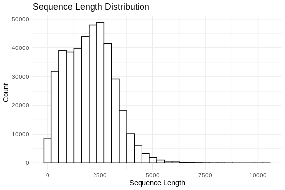

05-IsoSeq-transcriptome-check
================
Steven Roberts
20 July, 2023

Lets take look at Isoseq fasta

``` bash
cd ../data/

curl -O https://owl.fish.washington.edu/halfshell/genomic-databank/Mtros-hq_transcripts.fasta
```

``` r
# Load the sequences from a fasta file
fasta_path <- "../data/Mtros-hq_transcripts.fasta" # Change to your FASTA file path
dna_sequences <- readDNAStringSet(fasta_path)

# Calculate the lengths of the sequences
sequence_lengths <- width(dna_sequences)

# Convert to a data frame for ggplot
df <- data.frame(Length = sequence_lengths)

# Plot the length distribution
ggplot(df, aes(x = Length)) + 
  geom_histogram(color = "black", fill = "white", bins = 30) +
  theme_minimal() +
  labs(title = "Sequence Length Distribution",
       x = "Sequence Length",
       y = "Count")
```



``` r
# Number of sequences shorter than 500 bp
short_sequences <- sum(sequence_lengths < 500)
print(short_sequences)
```

    ## [1] 36551

``` r
really_short_sequences <- sum(sequence_lengths < 200)
print(really_short_sequences)
```

    ## [1] 10038
